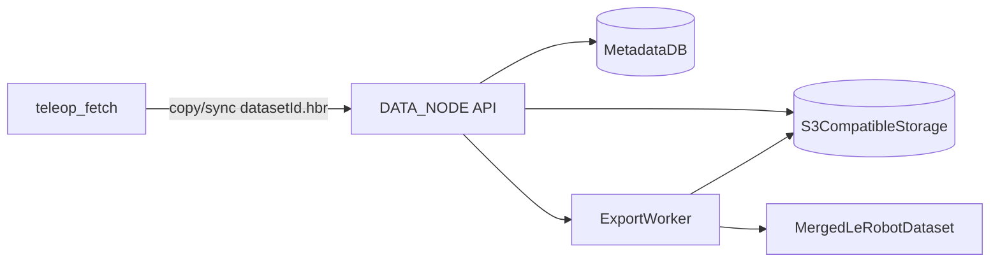

# DATA_NODE Architecture

## Service Topology

## Runtime Flow

1. Robot side finalizes `datasetId.hbr`.
2. Session registration call (`POST /sessions`) stores metadata.
3. DATA_NODE ingests dataset directory into object storage under deterministic keys.
4. API serves metadata and download endpoints.
5. Export endpoint triggers merge job for selected datasets by task.

## Internal Modules

- `api.sessions`: create/list/get/download session records.
- `api.exports`: queue and monitor merge jobs.
- `storage.s3`: upload/download/list object prefixes.
- `mapper.hbr`: parse `.hbr` metadata and manifests.
- `export.lerobot`: merge selected sessions to output schema.

## Non-Functional Targets

- Idempotent registration by `datasetId`.
- Safe concurrent uploads.
- Partial failure recovery with retry queue.
- Traceability (`requestId`, `datasetId`, timestamps in logs).
